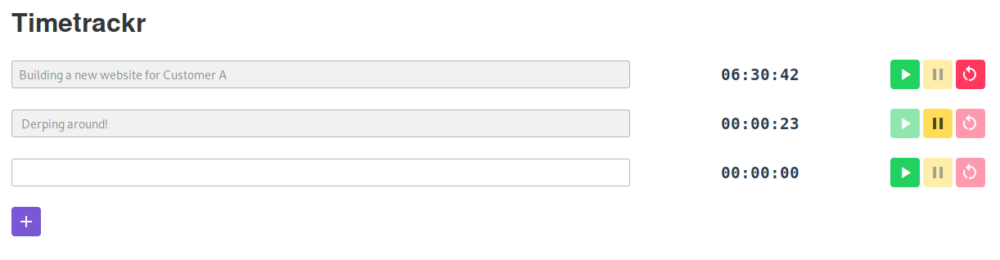

# timetrackr
Try the [Demo](https://timetrackr.netlify.com/) on Netlify



A small tool to help you keep track of your working hours.
This is especially helpful if you switch customers regularly and need multiple stopwatches.

## Project setup
```
yarn install
```

### Compiles and hot-reloads for development
```
yarn serve
```

### Compiles and minifies for production
```
yarn build
```

### Lints and fixes files
```
yarn lint
```

### Analyse bundle
```
vue ui
```
Go to Tasks > build > Run the task

### Customize configuration
See [Configuration Reference](https://cli.vuejs.org/config/).
